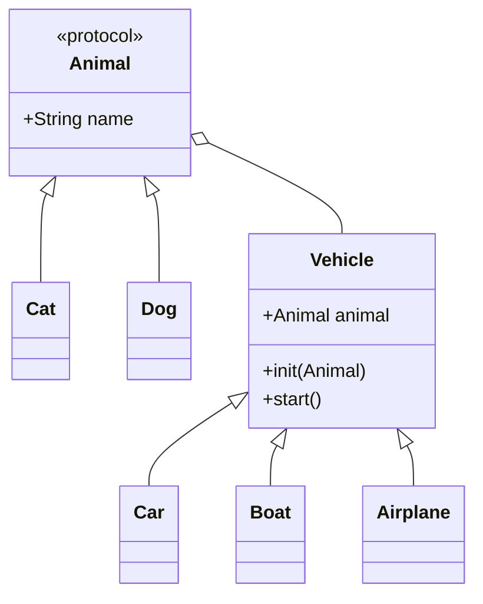

# Design Pattern
## Creational Design Pattern
### Factory Pattern
#### #1
```swift 
protocol Animal {
    func speak()
}

class Cat: Animal {
    func speak() { print("meow") }
}

class Dog: Animal {
    func speak() { print("bark") }
}

enum AnimalName {
    case cat, dog
}

func animalFactory(animalName: AnimalName) -> Animal {
    switch animalName {
    case .cat: return Cat()
    case .dog: return Dog()
    }
}

var cat = animalFactory(animalName: .cat)
cat.speak() // meow

var dog = animalFactory(animalName: .dog)
dog.speak() // bark
```
#### #2
```swift
protocol Animal {
    func speak()
}

class Cat: Animal {
    func speak() { print("meow") }
}

class Dog: Animal {
    func speak() { print("bark") }
}

enum AnimalName {
    case cat, dog
}

class AnimalFactory {
    func createAnimal(animalName: AnimalName) -> Animal {
        switch animalName {
        case .cat: return Cat()
        case .dog: return Dog()
        }
    }
}

var factory = AnimalFactory()
var cat = factory.createAnimal(animalName: .cat)
var dog = factory.createAnimal(animalName: .dog)

cat.speak() // meow
dog.speak() // bark
```
### Factory Method Pattern
팩토리에서 단순 생성만 하는것이 아니라 여러가지 기능을 추가하고 싶을 때 사용 합니다. 객체를 생성하는 메서드를 여러 Factory class에서 상속을 통해서 구현하였으면 Factory Method Pattern이 사용되었다고 할 수 있습니다. 예시에서는 class 상속이 아닌 protocol을 사용하였습니다.
```swift
protocol Animal {
    func speak()
}

class Cat: Animal {
    func speak() { print("meow") }
}

class Dog: Animal {
    func speak() { print("bark") }
}

protocol AnimalFactory {
    associatedtype AnimalType: Animal
    func createAnimal() -> AnimalType
}

class CatFactory: AnimalFactory {

    typealias AnimalType = Cat

    var catCount: Int = .zero

    func createAnimal() -> Cat {
        catCount += 1
        return Cat()
    }
}

class DogFactory: AnimalFactory {

    typealias AnimalType = Dog

    var dog: Dog?

    func createAnimal() -> Dog {
        return Dog()
    }

    func haveDog() {
        self.dog = createAnimal()
    }

    func makeWings(dog: Dog) -> Dog {
        print("dog wings added")
        return dog
    }
}

// Usage

var catFactory = CatFactory()
var cat = catFactory.createAnimal()
print("\(catFactory.catCount) cats are created") // 1 cats are created

var dogFactory = DogFactory()
var dog = dogFactory.createAnimal()
var wingFactory = dogFactory.makeWings(dog: dog) // dog wings added
```
### Abstract Factory Pattern
matrix 관계를 가진 class object들을 생성할 때 유용합니다. 하나의 팩토리 인터페이스를 가지고 matrix 관계로 표현되는 각 조합에 대해서 팩토리를 정의 합니다. 예시에서는 다크모드를 지원하는 UI 객체들의 조합을 생성하는 팩토리를 표현하였습니다.

```swift
/*
          | DarkMode         | LightMode
 ---------------------------------------------
 Button   | DarkModeButton   | LightModeButton
 CheckBox | DarkCheckBox     | LightCheckBox
 ScrollBar| DarkScrollBar    | LightScrollBar
 ---------------------------------------------
 */
class Button {
    var backgroundColor: UIColor { return .white }
}

class LightButton: Button {
    override var backgroundColor: UIColor { return .white }
}

class DarkButton: Button {
    override var backgroundColor: UIColor { return .black }
}

class CheckBox {
    var backgroundColor: UIColor { return .white }
}

class LightCheckBox: CheckBox {
    override var backgroundColor: UIColor { return .white }
}

class DarkCheckBox: CheckBox {
    override var backgroundColor: UIColor { return .black }
}

class ScrollBar {
    var backgroundColor: UIColor { return .white }
}

class LightScrollBar: ScrollBar {
    override var backgroundColor: UIColor { return .white }
}

class DarkScrollBar: ScrollBar {
    override var backgroundColor: UIColor { return .black }
}

protocol UIFactory {
    func getButton() -> Button
    func getCheckBox() -> CheckBox
    func getScrollBar() -> ScrollBar
}

class LightUIFactory: UIFactory {
    func getButton() -> Button { return LightButton() }
    func getCheckBox() -> CheckBox { return LightCheckBox() }
    func getScrollBar() -> ScrollBar { return LightScrollBar() }
}

class DarkUIFactory: UIFactory {
    func getButton() -> Button { return DarkButton() }
    func getCheckBox() -> CheckBox { return DarkCheckBox() }
    func getScrollBar() -> ScrollBar { return DarkScrollBar() }
}
```
### Builder Pattern
object의 생성 과정에 많은 argument가 필요하다거나 복잡할 때 이를 간단하게 만들 수 있습니다. builder의 각 setter 메서드에서 자기 자신인 builder를 리턴하도록 하면 체인 형태로 사용할 수도 있습니다.

```swift
class Cat {

    var height: Float
    var weight: Float
    var color: UIColor

    init(height: Float, weight: Float, color: UIColor) {
        self.height = height
        self.weight = weight
        self.color = color
    }
}

class CatBuilder {
    var height: Float = .zero
    var weight: Float = .zero
    var color: UIColor = .white

    func setHeight(_ h: Float) -> CatBuilder {
        self.height = h
        return self
    }

    func setWeight(_ w: Float) -> CatBuilder {
        self.weight = w
        return self
    }

    func setColor(_ c: UIColor) -> CatBuilder {
        self.color = c
        return self
    }

    func build() -> Cat {
        return Cat(height: height, weight: weight, color: color)
    }
}

var cat = CatBuilder()
    .setHeight(20)
    .setWeight(10)
    .setColor(.green)
    .build()
```
Builder 클래스를 상속하여 specific한 builder를 정의할 수 있습니다.
```swift
class WhiteCatBuilder: CatBuilder {
    override init() {
        super.init()
        self.color = .white
    }
}

class BlackCatBuilder: CatBuilder {
    override init() {
        super.init()
        self.color = .black
    }
}
```
필수는 아니지만 빌더를 세팅해 주는 목적의 Director를 정의할 수 있습니다.
```swift
class CatDirector {
    func setSamllCat(builder: CatBuilder) {
        builder
            .setWeight(5)
            .setHeight(5)
    }

    func setBigCat(builder: CatBuilder) {
        builder
            .setWeight(100)
            .setHeight(100)
    }
}

var catDirector = CatDirector()
var blackCatBuilder = BlackCatBuilder()
catDirector.setBigCat(builder: blackCatBuilder)
var cat = blackCatBuilder.build() // 100cm, 100kg, black
```
### Singleton Pattern
프로세스가 실행 중에 오직 하나의 object만 생성되도록 강제하는 디자인 패턴입니다.
```swift
class Cat {
    static let shared = Cat()
    private init() { }
}
```
### Prototype Pattern
일반적인 `Cat` class를 정의하고 `name`만 다른 두 객체를 생성하려고 합니다.
#### 🙅‍♂️ 단순 생성하여 속성을 하나하나 지정하는 경우
```swift
class Cat {
    var color: String?
    var eyeColor: String?
    var noseColor: String?
    var tailColor: String?
    var name: String?
}

var kitty = Cat()
kitty.color = "white"
kitty.eyeColor = "white"
kitty.noseColor = "white"
kitty.tailColor = "white"
kitty.name = "kitty"

var nabi = Cat()
nabi.color = "white"
nabi.eyeColor = "white"
nabi.noseColor = "white"
nabi.tailColor = "white"
nabi.name = "nabi"
```
#### 🙅‍♂️ 단순 복사하는 경우
```swift
class Cat {
    var color: String?
    var eyeColor: String?
    var noseColor: String?
    var tailColor: String?
    var name: String?

    func clone() -> Cat {
        let newCat = Cat()
        newCat.color = self.color
        newCat.eyeColor = self.eyeColor
        newCat.noseColor = self.noseColor
        newCat.tailColor = self.tailColor
        newCat.name = self.name
        return newCat
    }
}

var kitty = Cat()
kitty.color = "white"
kitty.eyeColor = "white"
kitty.noseColor = "white"
kitty.tailColor = "white"
kitty.name = "kitty"

var nabi = kitty.clone()
nabi.name = "nabi"
```
#### 🙆‍♂️ 프로토타입을 이용하는 경우
```swift

class Cat {
    var color: String?
    var eyeColor: String?
    var noseColor: String?
    var tailColor: String?
    var name: String?

    func clone() -> Cat {
        let newCat = Cat()
        newCat.color = self.color
        newCat.eyeColor = self.eyeColor
        newCat.noseColor = self.noseColor
        newCat.tailColor = self.tailColor
        newCat.name = self.name
        return newCat
    }
}

class BlackCat: Cat {
    override init() {
        super.init()
        self.color = "black"
    }
}

class WhiteCat: Cat {
    override init() {
        super.init()
        self.color = "black"
    }
}

var blackCat = BlackCat()
blackCat.noseColor = "pink"
blackCat.tailColor = "green" // 'blackCat' is prototype

var kitty = blackCat.clone()
kitty.eyeColor = "white"
kitty.name = "kitty"

var nabi = blackCat.clone()
nabi.eyeColor = "blue"
nabi.name = "nabi"
```
## Structural Design Pattern
### Adapter Pattern
하나의 인터페이스를 다른 인터페이스로 전환하는 패턴입니다. Wrapper라고 부르기도 합니다.
```swift
protocol Animal {
    func walk()
}

class Cat: Animal {
    func walk() { print("cat walking") }
}

class Dog: Animal {
    func walk() { print("dog walking") }
}

func makeWalk(animal: Animal) {
    animal.walk()
}

var kitty = Cat()
var bingo = Dog()

makeWalk(animal: kitty) //"cat walking"
makeWalk(animal: bingo) //"dog walking"
```
```swift
class Fish { // fish doesn't have a walk method
    func swim() {
        print("fish swimming")
    }
}

var nemo = Fish()

//makeWalk(animal: nemo) ❌
```
```swift
class FishAdapter: Animal {
    var fish: Fish

    init(fish: Fish) {
        self.fish = fish
    }

    func walk() { self.fish.swim() }
}

var adaptedNemo = FishAdapter(fish: nemo)
makeWalk(animal: adaptedNemo)
```
### Proxy Pattern
서버의 예를 들어보겠습니다. 서버를 구성할 때 Client와 Server사이에 Proxy 서버를 두는 것이 일반적입니다. Proxy 서버는 Server와 커뮤니케이션 하면서 클라이언트에 Response를 전달하는 기능 외에도 그 목적에 따라 로그나 통계 기능을 가지는 경우도 있습니다. 혹은 프록시 뒤에 있는 서버단의 부하를 줄이기 위해서 Request에 대한 Response를 캐시로 가지고 있기도 합니다.

이처럼 Client 코드가 있고 사용하기를 원하는 Object가 있을 때 Object에 직접 접근하지 않고 Proxy를 두고 Client는 Proxy를 통해서만 Object의 기능을 사용하는 패턴입니다.
```swift
class Cat {
    func speak() { print("meow") }
}

var kitty = Cat()
kitty.speak()

class CatProxy {

    var cat: Cat

    init(cat: Cat) { self.cat = cat}

    func speak() {
        print("willSpeak") // validity checks, lazy init, more
        self.cat.speak()
        print("didSpeak") // loggings
    }
}

var kittyProxy = CatProxy(cat: kitty)
kittyProxy.speak()
```
프록시가 대상 오브젝트를 상속받거나 같은 프로토콜을 따르는 식으로 구성하는 것도 가능합니다.
```swift
protocol Animal {
    func speak()
}

class Cat: Animal {
    func speak() { print("meow") }
}

class CatProxy: Animal {

    var cat: Cat

    init(cat: Cat) {
        self.cat = cat
    }

    func speak() {
        print("bofore speak")
        self.cat.speak()
        print("after speak")
    }
}

func doSpeak(animal: Animal) {
    animal.speak()
}

var kitty = Cat()
var kittyProxy = CatProxy(cat: kitty)

doSpeak(animal: kittyProxy)
```
### Facade Pattern
*facade: 건물의 정면*

퍼사드 패턴은 건물의 정면처럼 복잡한 부분은 뒤쪽에 숨겨두고 간단한 부분만 보여주는 패턴입니다. 3단 추진 로켓을 퍼사드로 표현한 예제입니다.
```swift
class Stage1 {
    func ignite() { print("1st stage ignition") }
    func liftOff() { print("1st stage liftOff") }
    func eject() { print("1st stage ejection") }
    func comeBack() { print("1st stage return") }
}

class Stage2 {
    func ignite() { print("2st stage ignition") }
    func liftOff() { print("2st stage liftOff") }
    func eject() { print("2st stage ejection") }
    func comeBack() { print("2st stage return") }
}

class Capsule {

    func ignite() { print("capsule ignition") }

    func landing() { print("capsule landing/deploy") }

}

class Rocket { // Facade

    var stage1 = Stage1()
    var stage2 = Stage2()
    var capsule = Capsule()

    func launch() {
        self.stage1.ignite()
        self.stage1.liftOff()
        self.stage1.eject()
        self.stage2.ignite()
        self.stage1.comeBack()
        self.stage2.eject()
        self.capsule.ignite()
        self.capsule.landing()
    }

}

// Usage
var rocket = Rocket()
rocket.launch()
```
### Decorator Pattern
서브클래싱 하지 않고 기능을 확장하는 패턴

```swift
protocol Animal {
    var sound: String { get }
}

class Dog: Animal {
    var sound: String {
        return "bark"
    }
}

class Cat: Animal {
    var sound: String {
        return "meow"
    }
}

class AnimalDecorator: Animal {

    var animal: Animal

    var sound: String {
        return animal.sound
    }

    init(animal: Animal) {
        self.animal = animal
    }

}

func makeSpeak(animal: Animal) {
    print(animal.sound)
}

class AnimalSmileDecorator: AnimalDecorator {
    override var sound: String {
        return "\(super.sound) 😄"
    }
}

class AnimalCryingDecorator: AnimalDecorator {
    override var sound: String {
        return "\(super.sound) 😭"
    }
}

// Usage

var kitty = Cat()
makeSpeak(animal: kitty) // "meow"

var kittySmile = AnimalSmileDecorator(animal: kitty)
makeSpeak(animal: kittySmile) // "meow 😄"

var kittySmileCrying = AnimalCryingDecorator(animal: kittySmile)
makeSpeak(animal: kittySmileCrying) // "meow 😄 😭"
```
### Bridge Pattern
브릿지 패턴은 *abstraction*과 *implementation*사이에 다리를 두어 *independently*하게 만듭니다.

```swift
protocol Animal {
    var name: String { get }
}

class Cat: Animal {
    var name: String { "cat" }
}

class Dog: Animal {
    var name: String { "dog" }
}

class Vehicle {
    
    var animal: Animal
    
    init(animal: Animal) {
        self.animal = animal
    }
    
    func start() { }
}

class Car: Vehicle {
    
    override func start() {
        print("\(animal.name) drives a car")
    }
    
}

class Boat: Vehicle {
    
    override func start() {
        print("\(animal.name) sails a boat")
    }
    
}

class Airplane: Vehicle {
    
    override func start() {
        print("\(animal.name) flies a plane")
    }
    
}

let cat = Cat()
let boat = Boat(animal: cat)
boat.start() // cat sales a boat

let dog = Dog()
let car = Car(animal: dog)
car.start() // dog drives a car
```
이 예시에서 *abstraction*과 *implementation*에 해당 하는 것은 `Vehicle`과 `Animal`입니다.
브릿지 패턴에서 abstraction이란 상대적으로 더 추상적인 관념인 고수준(high level) 레이어를 생각하면 됩니다. 그리고 implementation은 실제 구현 코드라고 생각하면 됩니다. 따라서 client는 `Vehicle`과 같은 abstraction 레이어만 볼 수 있는 것이고, 내부의 실제 implementation은 바깥에서 숨길 수 있는 구조를 만들 수 있습니다. 이처럼 바깥에서 보여지는 레이어와 내부 구현을 분리하는 패턴입니다. 다른 예시를 하나더 살펴봅니다.
```swift
// Implementor
protocol Power {
    var name: String { get }
    func powerUp()
    func powerDown()
}

extension Power {
    func powerUp() {
        print("\(name) power up")
    }
    
    func powerDown() {
        print("\(name) power down")
    }
}

class Engine: Power {
    var name: String { "Engine" }
}

class Motor: Power {
    var name: String { "Motor" }
}

// Abstraction
class Car {
    
    var power: Power
    
    init(power: Power) {
        self.power = power
    }
    
    func drive() {
        power.powerUp()
    }
    
    func stop() {
        power.powerDown()
    }
    
}

class Sedan: Car {
    func sedanOnlyFn() {
        print("sedan only")
    }
}
```
### Flyweight Pattern
다수의 Object를 사용할 때 공통된 데이터를 공유하여 메모리 사용량을 줄여주는 패턴입니다.
```swift
class Dog: CustomStringConvertible {

    var name: String
    var age: Int
    var gender: String
    var breed: String
    var DNA: String

    init(name: String, age: Int, gender: String, breed: String, DNA: String) {
        self.name = name
        self.age = age
        self.gender = gender
        self.breed = breed
        self.DNA = DNA
    }

    var description: String {
        return "\(name), \(age), \(DNA)"
    }

}

var choco = Dog(name: "choco", age: 2, gender: "male", breed: "shihTzu", DNA: "ATAGGCTTACCGATGG...")
var baduk = Dog(name: "baduk", age: 3, gender: "female", breed: "jindo", DNA: "ATAGGCTTACCGATGG...")

print(choco) // choco, 2, ATAGGCTTACCGATGG...
print(baduk) // baduk, 3, ATAGGCTTACCGATGG...
```
강아지를 표현하는 여러 속성이 있습니다. 그중에 DNA는 저장해야 할 정보가 많아서 메모리 사용량이 아주 큰 프로퍼티 입니다. 그래서 Dog 인스턴스를 생성할 때마다 DNA를 저장하기 위해서 메모리를 많이 잡아먹게 됩니다. 하지만 모든 강아지는 동일한 DNA를 가지므로(실제로는 그렇지 않지만) 각각의 강아지가 DNA 정보를 공유할 수 있다면 메모리를 절약할 수 있습니다.
```swift
class Dog: CustomStringConvertible {

    static let DNASeq = "ATAGGCTTACCGATGG..."

    var name: String
    var age: Int
    var gender: String
    var breed: String
    var DNA: String {
        return Dog.DNASeq
    }

    init(name: String, age: Int, gender: String, breed: String) {
        self.name = name
        self.age = age
        self.gender = gender
        self.breed = breed
    }

    var description: String {
        return "\(name), \(age), \(DNA)"
    }

}

var choco = Dog(name: "choco", age: 2, gender: "male", breed: "shihTzu")
var baduk = Dog(name: "baduk", age: 3, gender: "female", breed: "jindo")

print(choco) // choco, 2, ATAGGCTTACCGATGG...
print(baduk) // baduk, 3, ATAGGCTTACCGATGG...
```
DNA 변수를 static으로 정의하여 모든 Dog 객체가 공유하도록 했습니다. 이러면 모든 강아지마다 DNA 정보를 직접 저장하지 않게되어 메모리 사용을 줄일 수 있습니다.  
조금더 일반적인 예시를 알아보겠습니다. 이번에는 강아지가 각 종(breed)마다 고유한 DNA를 가진다고 가정합니다. breed와 DNA를 저장하는 타입을 하나 정의하고 이 타입의 값을 저장하는 테이블을 통해서 강아지마다 자신의 종에 해당하는 DNA를 매핑할 수 있도록 했습니다.
```swift
class DogBreedDNA: CustomStringConvertible {

    var breed: String

    var DNA: String

    init(breed: String, DNA: String) {
        self.breed = breed
        self.DNA = DNA
    }

    var description: String {
        return DNA
    }
}

class Dog: CustomStringConvertible {

    static var DNATable: [String: DogBreedDNA] = [:]

    static func addDNA(breed: String, DNA: String) {
        Dog.DNATable[breed] = DogBreedDNA(breed: breed, DNA: DNA)
    }

    var name: String
    var age: Int
    var gender: String
    var breed: String

    init(name: String, age: Int, gender: String, breed: String) {
        self.name = name
        self.age = age
        self.gender = gender
        self.breed = breed
        if Dog.DNATable[breed] == nil {
            fatalError("\(breed) is not in DNATable")
        }
    }

    var description: String {
        return "\(name), \(age), \(Dog.DNATable[breed])"
    }

}

Dog.addDNA(breed: "shihTzu", DNA: "ATAGGCTTACCGATGG...")
Dog.addDNA(breed: "jinDo", DNA: "ATAGGCTTACCGATGA...")

var choco = Dog(name: "choco", age: 2, gender: "male", breed: "shihTzu")
var baduk = Dog(name: "baduk", age: 3, gender: "female", breed: "jinDo")

print(choco) // choco, 2, ATAGGCTTACCGATGG...
print(baduk) // baduk, 3, ATAGGCTTACCGATGG...

var bbobbi = Dog(name: "bbobbi", age: 1, gender: "female", breed: "shiba") // Fatal error: shiba is not in DNATable
```
### Composite Pattern
한 Object의 그룹과 그 Object의 Single Instance가 같은 타입으로 취급되는 패턴입니다. 또한 Composite Pattern을 통해서 Object들을 트리 구조로 구성할 수 있습니다.

```swift
protocol Component {
    func operation()
}

class Leaf: Component {
    func operation() {
        print("Leaf|")
    }
}

class Composite: Component {

    private(set) var components = [Component]()

    func operation() {
        print("Composite|")
        components.forEach { component in
            component.operation()
        }
    }

    func add(_ component: Component) {
        components.append(component)
    }
}

var composite1 = Composite()
composite1.add(Leaf())
composite1.add(Leaf())

var composite0 = Composite()
composite0.add(Leaf())
composite0.add(composite1)

composite0.operation()
//Composite|
//Leaf|
//Composite|
//Leaf|
//Leaf|
```
예시에서 알 수 있듯이 컴포지트 패턴은 그룹과 오브젝트가 같은 인터페이스를 제공함으로써 루트에서 시작되는 함수 콜이 트리 안에 있는 모든 오브젝트로 함수 콜이 퍼지는 구조입니다.
## Behavioral Design Pattern
### Strategy Pattern
런타임에 실제 실행될 알고리즘이 결정될 수 있도록 합니다. (OCP)
```swift
protocol Animal {
    func speak()
}

class Cat: Animal {
    func speak() {
        print("meow")
    }
}

class Lion: Animal {
    func speak() {
        print("roar")
    }
}


func makeSpaek(animal: Animal?) {
    animal?.speak()
}

func createAnimal(inputString: String?) -> Animal? {
    if inputString == "cat" {
        return Cat()
    }
    else if inputString == "lion" {
        return Lion()
    }
    return nil
}

var inputString = readLine()
var animal = createAnimal(inputString: inputString)
makeSpaek(animal: animal)
```
### State Pattern
초록불 또는 빨간불 중에 하나의 상태를 가지는 신호등을 State Pattern을 사용하여 표현해 봅니다.
```swift
class TrafficLight {
    
    var state: TrafficLightState = GreenLight()
    
    func setState(_ newState: TrafficLightState) {
        self.state = newState
    }
    
    func speak() {
        self.state.status()
    }
    
    func wait() {
        self.state.changeLight(trafficLight: self)
    }
}

protocol TrafficLightState {
    func status()
    func changeLight(trafficLight: TrafficLight)
}

class GreenLight: TrafficLightState {
    func status() {
        print("green light")
    }
    
    func changeLight(trafficLight: TrafficLight) {
        print("wait.. the light changed")
        trafficLight.setState(RedLight())
    }
}

class RedLight: TrafficLightState {
    func status() {
        print("red light")
    }
    
    func changeLight(trafficLight: TrafficLight) {
        print("wait.. the light changed")
        trafficLight.setState(GreenLight())
    }
}

var trafficLight = TrafficLight()
trafficLight.speak() //green light
trafficLight.wait() //wait.. the light changed
trafficLight.speak() //red light
```
**Strategy Pattern 과 차이점?**
위의 Strategy Pattern 예시에서 `Cat`과 `Lion`은 서로의 존재를 알지 못합니다. 하지만 State Pattern에서 `GreenLight`와 `RedLight`는 `changeLight` 함수의 구현에서 보이는 것처럼 자신을 제외한 나머지 상태에 대해서도 알고 있어야 합니다. 또한 `setState` 함수를 호출하기 위해서 `TrafficLight` 객체에 접근하고 있습니다. 이렇게 자기 자신인 State를 소유하는 객체에 대해서 알아야 한다는 점 또한 Strategy Pattern과 차이를 보입니다.
